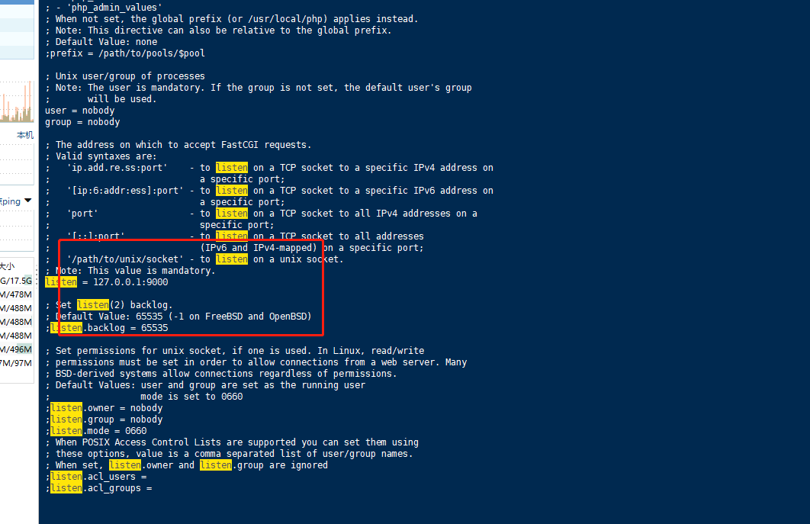

# php环境搭建过程

**安装过程：**

    yum -y install epel-release

    yum -y install  gcc gcc-c++ make pcre pcre-devel zlib zlib-devel openssl openssl-devel libxml2 libxml2-devel libcurl libcurl-devel libjpeg libjpeg-devel libpng libpng-devel freetype freetype-devel openldap openldap-devel libmcrypt libmcrypt-devel

    cd /usr/local/src/
    
    wget 'http://hk1.php.net/distributions/php-5.6.40.tar.gz'
    
    tar -zxf php-5.6.40.tar.gz
    
    cd php-5.6.40
    
    ./configure --prefix=/usr/local/php --with-config-file-path=/usr/local/php/etc --enable-ctype --with-mysql=mysqlnd --with-mysqli=mysqlnd --with-freetype-dir --with-jpeg-dir --with-png-dir --with-zlib --with-libxml-dir=/usr --enable-xml --disable-rpath --enable-bcmath --enable-shmop --enable-sysvsem --enable-inline-optimization --with-curl --enable-mbregex --enable-mbstring --with-mcrypt --with-gd --enable-gd-native-ttf --with-openssl --with-mhash --enable-pcntl --enable-sockets --with-ldap-sasl --with-xmlrpc --enable-zip --enable-soap --with-gettext --enable-fpm
    
    make && make install
    
    cp php.ini-production /usr/local/php/etc/php.ini

**php编译安装说明：**

--prefix指定php的安装目录

--with-config-file-path指定php的配置文件位置

--with-mysql、--with-mysqli让php可以操作mysql

--enable-fpm主要是nginx要来调用php语言得使用php-fpm

**环境变量**：

vim /etc/profile

    export PATH=$PATH:/usr/local/php/sbin/:/usr/local/php/bin/

**使用默认配置文件**：mv /usr/local/php/etc/php-fpm.conf.default /usr/local/php/etc/php-fpm.conf

**启动**：php-fpm

**检查配置文件**：php-fpm -t

**查看php-fpm的listen配置:**

查看php-fpm.conf 配置文件listen的端口配置

**查看进程：** ps -ef | grep php

**使用systemctl管理php-fpm:**

vim /usr/lib/systemd/system/php-fpm.service

**填入下面内容：**

    [Unit]
    Description=php-fpm
    After=network.target
    [Service]
    Type=forking
    ExecStart=/usr/local/php/sbin/php-fpm
    [Install]
    WantedBy=multi-user.target

**启动**：  systemctl start php-fpm

**停止**：  systemctl stop php-fpm

