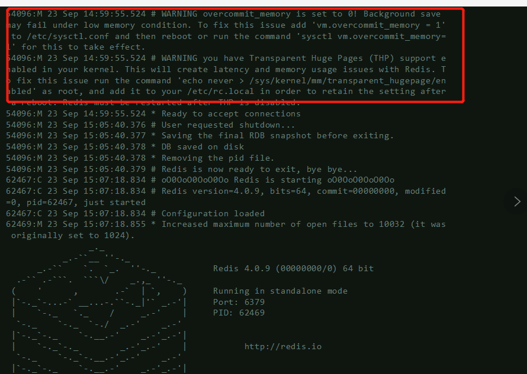

# redis运维

## 1.redis单机版源码编译安装搭建(4.0示例)

**redis下载地址**

https://redis.io/download

**redis源码编译**

    #!/bin/sh
    yum install -y wget gcc gcc-c++ make tar openssl openssl-devel cmake

    cd /usr/local/src
    wget 'http://download.redis.io/releases/redis-4.0.9.tar.gz'
    tar -zxf redis-4.0.9.tar.gz
    cd redis-4.0.9
    make

**redis安装在vim /usr/local/redis里面**

    mkdir -pv /usr/local/redis/conf /usr/local/redis/bin

    cp src/redis-* /usr/local/redis/bin/		#拷贝常用的二进制文件

    \rm /usr/local/redis/bin/*.c  /usr/local/redis/bin/*.o

    cp redis.conf /usr/local/redis/conf/		#拷贝配置文件

**验证和软链接的建立**

    /usr/local/redis/bin/redis-server --version

    /usr/local/redis/bin/redis-cli --version

    ln -s /usr/local/redis/bin/redis-cli /usr/local/bin/		#由于redis客户端经常使用，做个软链接

    redis-cli --version

## 2.redis启动和遇到的坑简单配置

**简化redis配置**

cp /usr/local/redis/conf/redis.conf /usr/local/redis/conf/redis.conf.bak

**去掉多余的注释**

cat /usr/local/redis/conf/redis.conf |egrep -v '^#|^$'

将上面cat后的数据重新写入reids配置文件里

(Vim删除所有内容命令为：**ggdG**

其中，gg为跳转到文件首行；dG为删除光标所在行以及其下所有行的内容；

再细讲，d为删除，G为跳转到文件末尾行；)

mkdir -pv /data/redis/	#创建redis的数据目录

**更改redis配置**

    vim /usr/local/redis/conf/redis.conf
    bind 127.0.0.1 xxx.xxx.xxx.xxx		#监听地址更改，0.0.0.0代表监控所有网卡
    port 6379						#监听端口更改，6379为默认
    daemonize yes				#是否后台启动
    pidfile /data/redis/redis.pid 		#pid存放目录
    logfile "/data/redis/redis.log"		#日志存放目录
    dir /data/redis/					#工作目录

**redis服务器启动和关闭**

    /usr/local/redis/bin/redis-server /usr/local/redis/conf/redis.conf	#启动redis服务器

    redis-cli

    SHUTDOWN  #关闭redis服务器

## 3.redis日志处理

注意启动后观察redis日志

1.Increased maximum number of open files to 10032 (it was originally set to 1024).最大文件打开数

解决方案：

    vim /etc/security/limits.conf 增加
    * - nofile 10240

**检查是否修改了**

 ulimit -n

2.The TCP backlog setting of 511 cannot be enforced because /proc/sys/net/core/somaxconn is set to the lower value of 128  最大连接

解决方案：

    vim /etc/sysctl.conf 增加

    net.core.somaxconn = 10240

**检查是否修改了**

    sysctl -p

    sysctl -a | grep soma

3.To fix this issue add 'vm.overcommit_memory = 1' to /etc/sysctl.conf   vm相关的一个错误

解决方案：

    vim /etc/sysctl.conf 增加

    vm.overcommit_memory = 1

    sysctl -p

    sysctl -a | grep soma
    

4.hugepage shutdown   最大内存页

echo never > /sys/kernel/mm/transparent_hugepage/enabled

vim /etc/rc.local

    echo never > /sys/kernel/mm/transparent_hugepage/enabled

5.删除日志再启动一下redis，然后再观察redis服务器

    \rm /data/redis/redis.log

    /usr/local/redis/bin/redis-server /usr/local/redis/conf/redis.conf

## 4.redis相关配置信息了解

redis提供一个info命令查看redis服务器的信息，类似linux提供一个top命令查看系统的信息；

使用redis-cli提供的info命令查看；

Server	表示redis服务器的信息，里面包含有启动时间等；

Clients	表示redis的客户端连接信息；

Memory	表示redis的内存使用信息

mem_fragmentation_ratio=used_memory_rss_human/used_memory_human	#redis发生增加删除的动作，会引起内存碎片化

mem_allocator:jemalloc-4.0.3	#内存分配使用的库，越好的库内存碎片化率越低。低版本的建议升级

Persistence	表示redis的持久化信息，redis虽然主要用来做缓存用，但也提供数据持久化功能，也就是把数据存盘。

Stats	表示redis的一些状态信息，常用来监控

total_connections_received	#一共接收了多少连接

total_commands_processed	#一共运行了多个命令

total_net_input_bytes		#总流入流量

total_net_output_bytes		#总流出流量

Replication	表示redis主从状态信息

CPU		表示redis占用的cpu情况

Cluster		表示redis的集群信息

Keyspace	表示redis key的分配情况

单独查看某块信息

redis-cli info Keyspace	#只查看key

redis-cli info clients		#只查看cpu信息