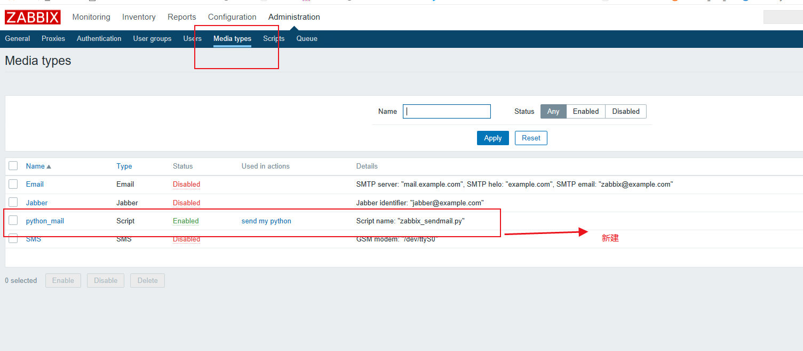

# zabbix学习（4.0.12）

## 1.zabbix部署以及zabbix编译安装

**zabbix的部署原理**

zabbix server需要把监控数据入sql数据库，所以得Mysql环境

zabbix的web是基于php开发的

部署zabbix server和zabbix web

所以我们部署安装zabbix前需要安装数据库和php以及nginx（代理zabbix webb）

**zabbix的官网**

https://www.zabbix.com/

### 1.Zabbix Server编译安装

    yum install -y libevent-devel wget tar gcc gcc-c++ make net-snmp-devel libxml2-devel libcurl-devel 

    useradd -s /sbin/nologin zabbix

    cd /usr/local/src/

    wget 'https://nchc.dl.sourceforge.net/project/zabbix/ZABBIX%20Latest%20Stable/4.0.3/zabbix-4.0.3.tar.gz'

    tar -zxvf zabbix-4.0.3.tar.gz

    cd zabbix-4.0.3

    ./configure --prefix=/usr/local/zabbix --enable-server --enable-agent --with-mysql=/usr/local/mysql/bin/mysql_config --with-net-snmp --with-libcurl --with-libxml2

    make  && make install

选项说明:

--prefix指定安装目录

--enable-server安装zabbix server

--enable-agent安装zabbix agent

--with-mysql用mysql来存储

### 2.zabbix server的安装验证

**环境变量设置** export PATH=$PATH:/usr/local/zabbix/sbin/:/usr/local/zabbix/bin/

**查看版本** zabbix_server --version

### 3.zabbix server的启动

需要到mysql里做数据库初始化

配置zabbix server，最主要是配置连接mysql的用户名和密码

启动zabbix server

**Mysql数据库初始化**

    mysql -h 127.0.0.1 -uroot -pzabbixpwd -A

    create database zabbix character set utf8 collate utf8_bin;

    grant all privileges on zabbix.* to zabbix@'127.0.0.1' identified by 'zabbixpwd';

    flush privileges;

    set names utf8;

    use zabbix;

    source /usr/local/src/zabbix-4.0.12/database/mysql/schema.sql;

    source /usr/local/src/zabbix-4.0.12/database/mysql/data.sql;

    source /usr/local/src/zabbix-4.0.12/database/mysql/images.sql;

**zabbix server的配置**

vim /usr/local/zabbix/etc/zabbix_server.conf

    LogFile=/usr/local/zabbix/zabbix_server.log
    DBHost=127.0.0.1
    DBName=zabbix
    DBUser=zabbix
    DBPassword=zabbixpwd
    DBPort=3306
    Timeout=30
    AlertScriptsPath=/usr/local/zabbix/alertscripts
    ExternalScripts=/usr/local/zabbix/externalscripts
    LogSlowQueries=3000

**启动zabbix server**

    chown zabbix:zabbix -R /usr/local/zabbix/

    zabbix_server

**验证**

进程

端口

日志

### 4.Zabbix Web的安装

    mkdir /usr/local/nginx/html/zabbix

    cp -a /usr/local/src/zabbix-4.0.3/frontends/php/* /usr/local/nginx/html/zabbix/

访问zabbix web，需要做一些初始化配置

http://ip地址/zabbix/

**zabbix web需要php做配置优化（注：php.ini配置文件）**

	post_max_size = 32M

	max_execution_time = 350

    max_input_time = 350

	date.timezone = Asia/Shanghai

	always_populate_raw_post_data = -1

	systemctl restart php-fpm

**登录zabbix**

	默认用户名和密码：Admin  zabbix  

	禁用Zabbix server主机的监控

    禁用guest用户

    更改Admin的密码，改成自己的密码

## 2.zabbix添加监控项目

**1.添加主机租**

**2.添加主机**

## 3.简单的一些监控

**1.相关信息介绍**

**2.查看监控信息**

## 4.Zabbix邮件告警

zabbix再写zabbix前需要写py脚本执行邮件发送

**下面是zabbix放脚本的位置**

创建相关文件：

mkdir –p /usr/local/zabbix/alertscripts

py脚本如下：

vim /usr/local/zabbix/alertscripts/zabbix_sendmail.py

    #!/usr/bin/python
    # -*- coding: utf-8 -*-
    from email.mime.text import MIMEText
    from email.header import Header
    from smtplib import SMTP_SSL
    import sys

    smtpaddr = 'smtp.qq.com'
    myemail='QQ号@qq.com'
    password='自己的邮箱授权码'
    recvmail=sys.argv[1]
    subject=sys.argv[2]
    content=sys.argv[3]

    msg = MIMEText("""%s"""%(content), "plain", "utf-8")
    msg['Subject'] = Header(subject, 'utf-8').encode()
    msg['From'] = myemail
    msg['To'] =  recvmail

    try:
    smtp = SMTP_SSL( smtpaddr )
    smtp.login(myemail, password)
    smtp.sendmail(myemail, recvmail.split(','), msg.as_string())
    smtp.quit()
    print("success")
    except Exception as e:
    print("fail: "+str(e))

 **测试脚本**

/usr/local/zabbix/alertscripts/zabbix_sendmail.py 邮箱号@qq.com 'zabbix disk' 'content: disk > 90%'
   

**以下是zabbix页面配置相关示例：**

**Zabbix邮件告警配置**

 写一个邮件告警的脚本，需要测试成功

报警媒介添加邮件告警

 用户设置报警媒介

  创建触发器动作

**报警媒介添加邮件告警**

自定义脚本

脚本名称：zabbix_sendmail.py

脚本需要三个参数

    {ALERT.SENDTO}
    {ALERT.SUBJECT}
    {ALERT.MESSAGE}

**用户添加报警媒介**

类型选择邮件告警

触发器有多种触发，从信息 -> 灾难，可定义接收哪种类型的告警

用户需要对服务器可读

**创建触发器动作**

动作有多种事件源，告警的选择触发器

邮件主题定义 -> {ALERT.SUBJECT}

邮件内容定义 -> {ALERT.MESSAGE}

操作添加发送邮件告警

恢复添加发送邮件告警

<<<<<<< HEAD
=======
## 5.客户端监控、简单监控比较

1.能获取到更多的监控信息，例如cpu、内存等

2.zabbix客户端内置了很多key，方便我们监控基本硬件信息

3.zabbix客户端能够自定义监控，方便我们监控部署的应用

**Zabbix Agent编译安装**

    yum install -y gcc gcc-c++ make pcre-devel

    useradd -s /sbin/nologin zabbix

    cd /usr/local/src/

    wget 'https://nchc.dl.sourceforge.net/project/zabbix/ZABBIX%20Latest%20Stable/4.0.3/zabbix-4.0.3.tar.gz'

    tar -zxvf zabbix-4.0.3.tar.gz

    cd zabbix-4.0.3

    ./configure --prefix=/usr/local/zabbix --enable-agent

    make && make install

    chown zabbix:zabbix -R /usr/local/zabbix/

**环境变量配置**

PATH=$PATH:/usr/local/zabbix/sbin/:/usr/local/zabbix/bin/

**zabbix agent配置**

Server和ServerActive上配置的是zabbix server的ip

    PidFile=/usr/local/zabbix/zabbix_agentd.pid
    LogFile=/usr/local/zabbix/zabbix_agentd.log
    Hostname=xxx(honame 名字)
    Server=xxx（zabbix服务地址）
    ServerActive=xxx（zabbix服务地址）
    UnsafeUserParameters=1
    Include=/usr/local/zabbix/etc/zabbix_agentd.conf.d/*.conf

**zabbix agent启动**

/usr/local/zabbix/sbin/zabbix_agentd

**验证zabbix agent有没有成功启动**

进程	

端口

日志

## 6.zabbix监控linux系统

zabbix_get

zabbix提供一个zabbix_get工具，可以跟zabbix agent通讯获取监控信息

使用方式：zabbix_get -s xxx -k xxx	

zabbix agent查看所有可监控项目：zabbix_agentd -p

**监控cpu负载**

    key: system.cpu.load[all,avg1]     Float型
    key: system.cpu.load[all,avg5]  Float型
    key: system.cpu.load[all,avg15] Float型

**监控cpu使用和空闲**

    system.cpu.util[,iowait,] Float型
    system.cpu.util[,system,] Float型
    system.cpu.util[,user,] Float型
    system.cpu.util[,idle,] Float型

监控剩余内存(buffers\cached实际上也是剩余的)

vm.memory.size[available]

**监控磁盘**

名称：Disk pfree on $1
名称：inode pfree on $1
    vfs.fs.size[/,pfree]  Float型
    vfs.fs.inode[/,pfree]  Float型

**监控流量**

    net.if.in[eth0]			整形(每秒速率) 默认返回字节数，需要*8   
    net.if.out[eth0]   整形(每秒速率) 默认返回字节数，需要*8

**Shell计算流量**

    onetime=$(ifconfig|grep eth0 -A 6|grep 'RX packets'|awk '{print $5}')
    sleep 30
    twotime=$(ifconfig|grep eth0 -A 6|grep 'RX packets'|awk '{print $5}')
    echo "incoming traffic is $((($twotime-$onetime)/30*8))bps"

    onetime=$(ifconfig|grep eth0 -A 6|grep 'TX packets'|awk '{print $5}')
    sleep 30
    twotime=$(ifconfig|grep eth0 -A 6|grep 'TX packets'|awk '{print $5}')
    echo "outer traffic is $((($twotime-$onetime)/30*8))bps"

## 7.zabbix监控相关示例配置

**zabbix系统自带linux监控模板**

Template OS Linux  根据需求做相关的删除避免不必要的监控造成mysql数据库压力过大

## 8.Zabbix Proxy分布式安装

先安装Mysql，缓存监控数据 （详见mysql数据库安装需要注意mysql数据版本问题）

安装Zabbix Proxy

需要初始化数据库

**Zabbix Proxy安装脚本**

    yum install -y tar gcc make gcc-c++ net-snmp-devel libxml2-devel libcurl-devel pcre-devel 

    useradd -s /sbin/nologin zabbix

    cd /usr/local/src/

    wget 'https://nchc.dl.sourceforge.net/project/zabbix/ZABBIX%20Latest%20Stable/4.0.3/zabbix-4.0.3.tar.gz'

    tar -zxvf zabbix-4.0.12.tar.gz

    cd zabbix-4.0.12

    ./configure --prefix=/usr/local/zabbix --enable-proxy --enable-agent --with-mysql --with-net-snmp --with-libcurl --with-libxml2

    make && make install

    chown zabbix:zabbix /usr/local/zabbix/ -R

**可能遇到的错误**

/usr/local/zabbix/sbin/zabbix_proxy: heartbeat sender [sending heartbeat message]: relocation error: /usr/local/zabbix/sbin/zabbix_proxy: heartbeat sender [sending heartbeat message]: symbol compressBound, version libmysqlclient_18 not defined in file libmysqlclient.so.18 with link 

恭喜你mysql数据版本安装的不对存在不兼容现象

>>>>>>> c8e3fdb9decb7f26e235d304e494e64f44e982f3
